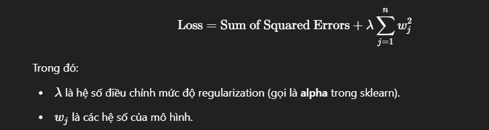

# Dự Đoán Giá Nhà với Ridge Regression

## Mô tả dự án
- Bài tập lớn môn **Nhập Môn Trí Tuệ Nhân Tạo**.
- Ứng dụng **thuật toán hồi quy tuyến tính** có regularization (để giảm overfitting) để dự đoán giá nhà.

## Ridge Regression là gì?
- Ridge Regression là một dạng **Linear Regression có L2 regularization**.
- Thêm một khoản phạt vào hàm mất mát dựa trên tổng bình phương các hệ số (weights).
- Mục đích: **Giảm overfitting** bằng cách ép các hệ số nhỏ lại.

### Công thức hàm mất mát Ridge Regression:



---

## Hướng dẫn cài đặt
Tải và cài đặt các thư viện cần thiết:

```bash
pip install -r requirements.txt
```

---

## Dữ liệu
- **File gốc**: `real_estate_listings.csv` (~25,000 dòng dữ liệu)

### Tiền xử lý dữ liệu
- **File**: `Data_Preprocessing.ipynb`
- Các bước: Chuẩn hóa, fill giá trị thiếu, lọc dữ liệu không hợp lệ.

### Dữ liệu sau xử lý
- `df1.csv`: Khoảng 12,000 dữ liệu sau lọc.
- `df2.csv`: Khoảng 14,300 dữ liệu (gồm 12,000 dữ liệu gốc và 2,300 dữ liệu fill thêm).

---

## Thực thi mô hình
- **File test các model**: `Model.ipynb`
- **File Demo**: `Demo.ipynb`

---

## Kết quả cuối cùng (tối ưu nhất)
- Data sử dụng: df1.csv
- Số mẫu sau khi xử lý: 10,237
- Số đặc trưng sau one-hot encoding: 160

- Tối ưu tham số alpha:
alpha=0.1: R² trên validation = 0.9327
alpha=1.0: R² trên validation = 0.9332
alpha=10.0: R² trên validation = 0.9371
=> Giá trị alpha tối ưu: 10.0

- Hiệu suất mô hình:
Trên tập train:
R² Score: 0.9769

Trên tập test (dữ liệu đã log-transform):
Mean Absolute Error (MAE): 0.0270
Root Mean Squared Error (RMSE): 0.1502
R² Score: 0.9265

Trên dữ liệu gốc (không log-transform):
Mean Absolute Error (MAE): 126,696,258 VND
Root Mean Squared Error (RMSE): 619,338,436 VND
R² Score: 0.9350

- Đồ thị biểu diễn:
Giá thực tế vs Giá dự đoán: prediction_scatter.png
Phân phối của Price (sau log-transform): price_distribution.png

---

## Ghi chú
- Mô hình sử dụng Ridge Regression.
- Các metric đánh giá: R2 Score, Mean Squared Error, Mean Absolute Error.
- Có so sánh nhiều mô hình để đánh giá hiệu quả.

---

## Thắc mắc thêm vui lòng liên hệ 
- Xuanuio.
